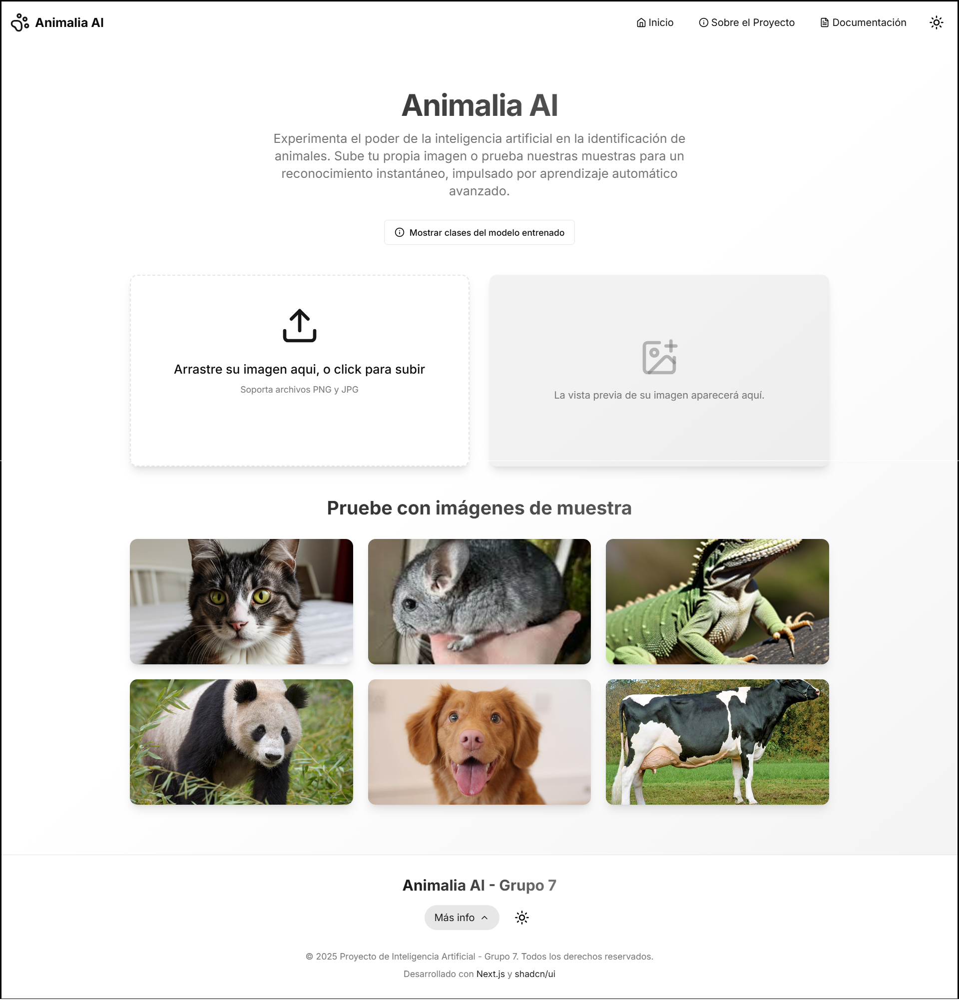

# 🧠 Next AI Animal Recognition  

**Proyecto Final - Cátedra de Inteligencia Artificial**  
📍 [Repositorio en GitHub](https://github.com/Dennis290699/next-ai-animal-recognition.git)  

## 📌 Descripción  
**Next AI Animal Recognition** es una aplicación web desarrollada con **Next.js** y **Nest.js**, diseñada para reconocer animales mediante inteligencia artificial. Este sistema procesa imágenes utilizando un modelo previamente entrenado para identificar distintas especies con alta precisión.  

## 🚀 Características  
✅ Implementación de IA para reconocimiento de animales.  
✅ Modelo preentrenado cargado en la aplicación.  
✅ Interfaz moderna y responsiva en **Next.js**.  
✅ Backend optimizado con **Nest.js** para procesamiento eficiente.  
✅ Visualización de resultados con métricas y matriz de confusión.  

## 🖥️ Tecnologías Utilizadas  
- **Frontend:** Next.js (React, TypeScript)  
- **Backend:** Nest.js (TypeScript)  
- **Inteligencia Artificial:** TensorFlow.js  
- **Visualización de datos:** TensorBoard, Matplotlib  
- **Gestión de dependencias:** npm  
- **Control de versiones:** Git & GitHub  

## 📂 Estructura del Proyecto  
```
📦 next-ai-animal-recognition
 ┣ 📂 app/               # Estructura de rutas de la aplicación (Next.js)
 ┣ 📂 components/        # Componentes reutilizables
 ┣ 📂 lib/services/      # Procesamiento de imágenes y lógica de IA
 ┣ 📂 public/Assets/     # Imágenes de muestra y otros recursos
 ┣ 📂 public/Model/      # Pesos y configuración del modelo de IA
 ┣ 📂 server/            # Backend con Nest.js
 ┣ 📜 package.json       # Dependencias y configuración del proyecto
 ┗ 📜 tsconfig.json      # Configuración de TypeScript
```

## 📸 Capturas de Pantalla  
  
*Pagina principal.*  

## 🏗️ Instalación y Ejecución  

### 🔹 Requisitos Previos  
- **Node.js** (v18 o superior)  
- **npm** o **yarn** instalado  

### 🔹 Instalación  
Clona el repositorio y accede al directorio:  
```bash
git clone https://github.com/Dennis290699/next-ai-animal-recognition.git
cd next-ai-animal-recognition
```
Instala las dependencias:  
```bash
npm install
```

### 🔹 Ejecución  
Para iniciar la aplicación en modo desarrollo:  
```bash
npm run dev
```
La aplicación estará disponible en `http://localhost:3000/`.  

Si deseas ejecutar el backend de Nest.js:  
```bash
npm run start:server
```

## 🧠 Modelo de Inteligencia Artificial  
El modelo de IA utilizado en esta aplicación está basado en redes neuronales convolucionales (CNNs) y ha sido entrenado con un conjunto de datos de imágenes de animales. Se encuentra en la carpeta:  
```
📂 public/Model/
 ┣ 📜 model.json
 ┗ 📜 model.weights.bin
```
Para visualizar métricas de entrenamiento, se incluye la matriz de confusión en `public/Assets/console-out/matrix-confuse.png`.  

## 👨‍💻 Integrantes del Proyecto  

Un agradecimiento especial a los colaboradores que ayudaron a dar forma a este proyecto desde el inicio:

|  |  |  |
|:-------------------------------------------------:|:-------------------------------------------------:|:-------------------------------------------------:|
| **[Dennis290699](https://github.com/Dennis290699)**   | **[Bryan1093](https://github.com/Bryan1093)**   | **[XavierT1](https://github.com/XavierT1)**   |


## 📜 Licencia  
Este proyecto está bajo la licencia **MIT**. Puedes ver más detalles en el archivo `LICENSE`.  
